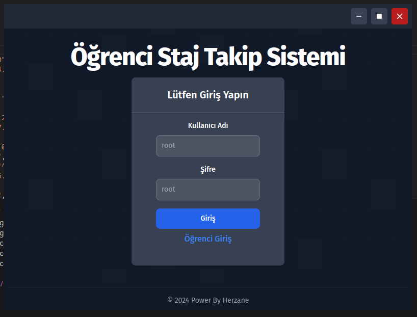
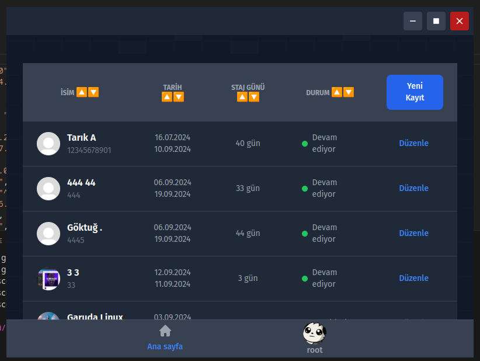
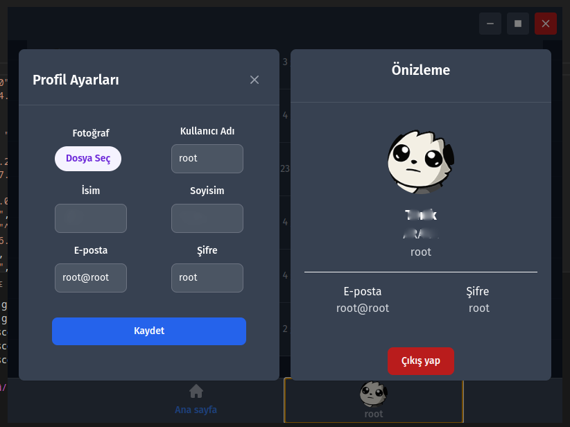
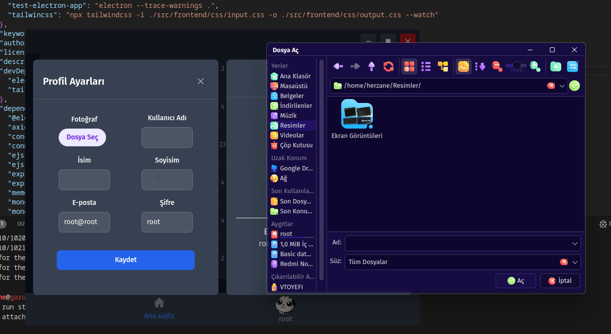
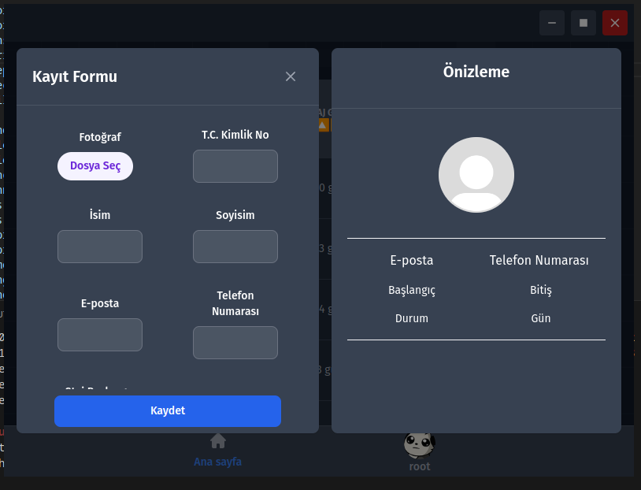

 

# Electron.js Stajyer takip uygulaması

# Not: Bu proje tam olarak bitmemiş bir projedir.
-Eksik kısımlar ve sorunlar bulunmaktadır bu porjeyi kendimi geliştirmek amacıyla geliştirdim tamamlamayı planlamıyorum
-

### Önkoşullar 📜

Projeyi çalıştırmak için aşağıdaki araçlara ihtiyacınız olacak:

- Node.js 🌐
- npm (Node.js ile birlikte gelir) 📦
- MongoDB 🍃

### Kurulum 🔧

1. Bu depoyu klonlayın veya indirin. 📥
2. Bağımlılıkları yüklemek için terminalde aşağıdaki komutları çalıştırmalısınız.
```
npm install
npm run tailwincss
```
3. `/src/config.json` dosyasına mongodb urls'i girmeniz gerekiyor 🔑

4. Çalıştırma
 `npm run start` Komutu ile projeyi çalıştırabilirsiniz.


# Görseller
 
 
 
 


# Yardım ve Destek 🆘
Herhangi bir sorunla karşılaşırsanız kendi başınasınız.

